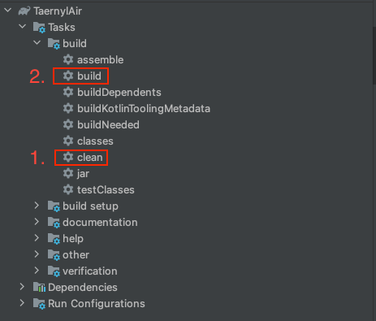

# 오류

```
오류: 기본 클래스 FlightWatcherKt을(를) 찾거나 로드할 수 없습니다.
원인: java.lang.ClassNotFoundException: FlightWatcherKt
```


# 발생 원인

``build.gradle`` 파일에 아래의 ``buildscript`` 블록 및 ``apply plugin`` 라인을 추가했을 때 발생 

```
buildscript {
    ext.atomicfu_version = '0.18.3'

    dependencies {
        classpath "org.jetbrains.kotlinx:atomicfu-gradle-plugin:$atomicfu_version"
    }
}

apply plugin: 'kotlinx-atomicfu'
```

# 발생 이유
아직 잘 모르겠음.


# 해결 방법

IntelliJ의 우측 탭에 'Gradle'탭을 클릭 후
1. Clean
2. Build

후 실행 하면 정상적으로 동작한다.

